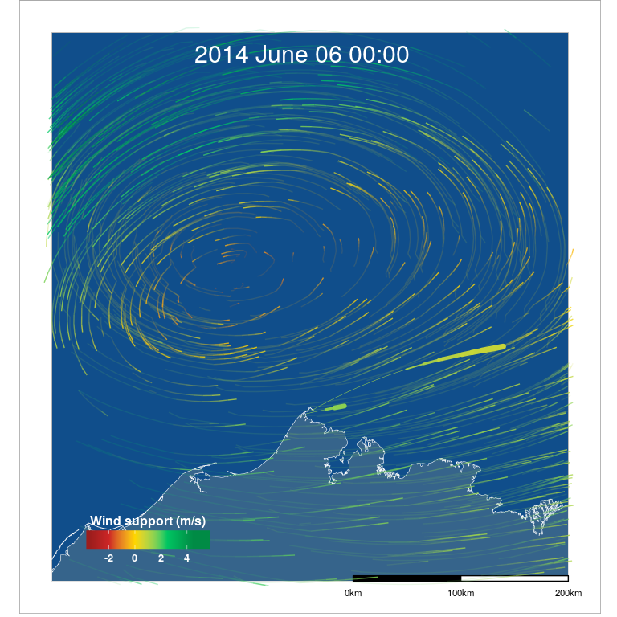

README
================

[](https://travis-ci.org/mpio-be/windR) [](https://codecov.io/github/mpio-be/windR?branch=master) [](http://www.repostatus.org/#active) [](https://www.gnu.org/licenses/gpl-3.0) [](https://github.com/ellerbrock/open-source-badges/)

### Warning!

This package is still in pre-release alpha version. Work in progress. Use at own risk.

WindR
-----

`windR` is a R package to connect animal tracking data with wind data (or sea current data) and allows to visulize animal movements within the flow of the medium that they move in.

Describe vignettes...



### To do

-   make vignettes travis proof
-   make getWind function testthat proof

### Inspiration & Background

This project was inspired by the awesome [earth](https://earth.nullschool.net/) project from [Cameron Beccario](https://github.com/cambecc), which was itself inspired by the [wind map](http://hint.fm/wind) project from [HINT.FM](http://hint.fm/).

We saw these particle flow maps of the wind and wanted to see our bird tracks within such visualization. Both `earth` and `wind map` use fixed times of global wind data sets (one wind layer). Particles are randomly thrown in the map and move based on the wind speed and direction. To plot our bird tracks within the wind, we needed to find a way to continuously change the wind data with the time that the birds moved. We did so by always using the closest wind data in time, resulting in a dynamic flow of the wind particles changing over time. We did our best to make this workflow fast in R, but know that using other programming languages (i.e. JavaScript) could improve the speed of these analyses. We are happy if somebody wants to improve (speed-up) this script or translates parts (esp. the particle creation) into another programming language.

### Installation

``` r
install.packages("devtools")
devtools::install_github("mpio-be/windR")
```
