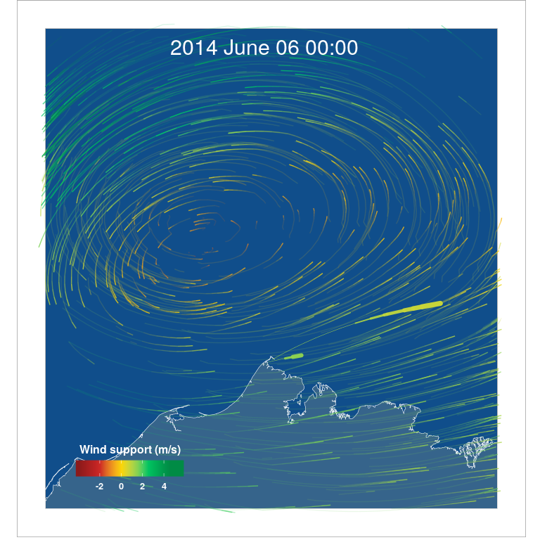

README
================

[](https://travis-ci.org/mpio-be/windR) [](https://codecov.io/github/mpio-be/windR?branch=master) [](http://www.repostatus.org/#active) [](https://www.gnu.org/licenses/gpl-3.0) [](https://opensource.org/)

### Warning!

This package is still in pre-release alpha version. Work in progress. Use at own risk.

To do
-----

-   make vignettes travis proof
-   check getWind function (make it testthat proof & faster with raster)
-   check if there is a way to make the particle creation faster

WindR
-----

`windR` is a R package to connect animal tracking data with wind data (or sea current data) and allows to visualize animal movements within the flow of the medium that they moved in.

#### What can you do with `windR`?

`windR` uses wind data from [ERA-Interim](https://www.ecmwf.int/en/forecasts/datasets/reanalysis-datasets/era-interim) (a global atmospheric reanalysis model) described in detail in [Dee et al. 2011](https://rmets.onlinelibrary.wiley.com/doi/abs/10.1002/qj.828) and connects them wind tracking data (your own). It can be used to create particle flow animations of wind or sea current data. To connect them with tracking data, it is necessary to calculate the bearing (ground direction), ground speed, wind support and cross winds from animal tracks using an equal area map projection (e.g.[Lambert azimuthal equal-area projection](https://en.wikipedia.org/wiki/Lambert_azimuthal_equal-area_projection)). The wind support represents the length of the wind vector in the direction of the birds’ flight and the cross wind represents the length of the wind vector perpendicular to ground vector (see [Safi et al. 2013](https://movementecologyjournal.biomedcentral.com/articles/10.1186/2051-3933-1-4) for [schematic representation](http://media.springernature.com/full/springer-static/image/art%3A10.1186%2F2051-3933-1-4/MediaObjects/40462_2013_Article_4_Fig1_HTML.jpg)). For a detailed description see the workflow example described below.



The **figure** shows an example snapshot of the particle flow animation including two male Pectoral Sandpipers (thick comets in light green) that left the area around Barrow (northern tip of Alaska) coloured with the wind support (m/s) and wind particles coloured with the wind speed (m/s; same scale as wind support) flying around based on the wind data at this time. Map projection: polar Lambert azimuthal equal-area with longitude origin 156.65° W (Barrow); Map data from [Natural Earth](http://www.naturalearthdata.com)

#### Workflow example

The [vignettes](http://r-pkgs.had.co.nz/vignettes.html) give a small step by step example of what one has to do to reach the final result (a particle flow animation with animal tracks). The single vignettes are built up on each other, but each can be run independently (since the output data of each step can be loaded from the package data).

The first vignette [A\_ERA\_Interim\_data\_download](insert%20link%20to%20html) describes how to download the ERA-Interim data using a python script. Note that single month can also be downloaded via the [website](http://apps.ecmwf.int/datasets/data/interim-full-daily/levtype=sfc/) directly.

The second vignette [B\_Wind\_data\_manipulation](insert%20link%20to%20html) describes how to open the wind data, interpolate them to a higher resolution and transform them in a [data.table](https://cran.r-project.org/web/packages/data.table/vignettes/datatable-intro.html) including the date and u- & v-wind component.

The third vignette [C\_Wind\_particle\_flow](insert%20link%20to%20html) describes on how to use wind data to calculate a particle flow (how to create particles) and how to create an animation with them.

The forth vignette [D\_Wind\_support\_and\_track\_animation](insert%20link%20to%20html) describes how to connect animal tracks (using a subset of data from [Kempenaers & Valcu 2017](https://www.nature.com/articles/nature20813)) with wind data and how to calculate the bearing, ground speed, wind support and cross winds from the tracks. Afterwards, it gives an example of how to plot the tracking data in a simple ggplot and how to do a comet plot animation using tracking data.

The fifth vignette [F\_Wind\_animation\_with\_tracks](insert%20link%20to%20html) brings everything together. It combines the particle flow animation of the wind data with the tracking data.

#### Tips to get started with your own data

-   Follow the vignettes and run the examples.
-   Start small with your own data! Take a small subset of your data to go thru the whole process (of whatever you want to do). Starting with a big data set makes everything slow and will make you soon frustrated. If everything is as you which with your small subset – go big and create particles for the whole period of your interest.
-   Find the optimal spatial and temporal scale fitting to your tracking data and question.
-   Have fun!

### Installation

``` r
install.packages('devtools')
devtools::install_github('mpio-be/windR')

# install with vignettes
devtools::install_github('mpio-be/windR', build_vignettes = TRUE)
```

#### Limitations

All analyses are constrained by the spatio-temporal resolution of the used wind and tracking data.

### Inspiration & Background

This project was inspired by the awesome [earth](https://earth.nullschool.net/) project from [Cameron Beccario](https://github.com/cambecc), which was itself inspired by the [wind map](http://hint.fm/wind) project from [HINT.FM](http://hint.fm/).

We saw these particle flow maps of the wind and wanted to see our bird tracks within such a visualization. Both `earth` and `wind map` use fixed times of global wind data sets (one wind layer). Particles are randomly thrown in the map and move based on the wind speed and direction. To plot our bird tracks within the wind, we needed to find a way to continuously change the wind data with the time that the birds moved. We did so by always using the closest wind data in time (continuously changing the wind layers), resulting in a dynamic flow of the wind particles changing over time. We did our best to make this workflow fast in R, but know that using other programming languages (i.e. JavaScript) could improve the speed of these analyses. We are happy if somebody wants to improve (speed-up) this script or translates parts (esp. the particle creation) into another programming language.
